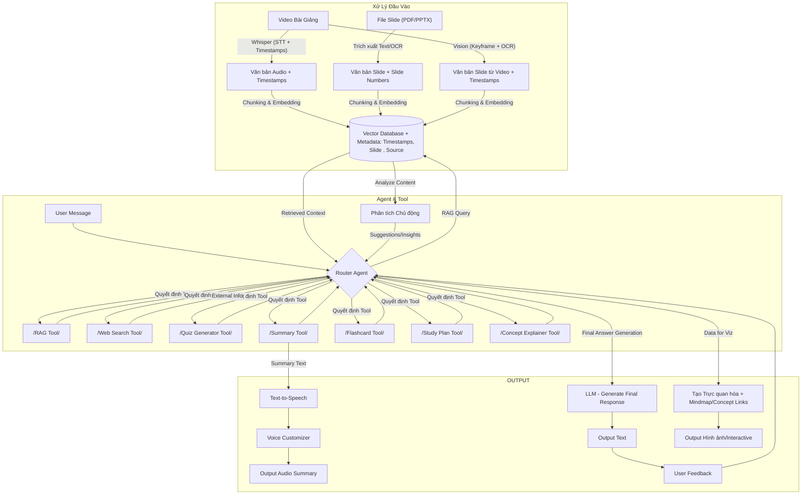

# Sơ đồ dự kiến: 

## Cấu trúc API

API được thiết kế với 3 endpoint chính:

### 1. `/upload` - Xử lý và lập chỉ mục tài liệu

**Quy trình:**
- Sinh viên upload file (PDF, PPTX, DOCX, v.v.)
- File được lưu vào thư mục uploads
- Xử lý file đồng bộ:
  - Trích xuất văn bản (PDF → PyMuPDF, PPTX → python-pptx, DOCX → python-docx)
  - Chia nhỏ (chunking) bằng RecursiveCharacterTextSplitter
  - Tạo embedding bằng SentenceTransformer
  - Lưu vào Milvus với metadata (slide number, source)
- Trả về kết quả (số tài liệu đã thêm)

### 2. `/ask` - Truy vấn thông tin

**Quy trình:**
- Gọi LearningAssistant.answer
- intent_analyzer_node phân tích ý định
- Nếu là câu hỏi thông thường → RAG (truy xuất từ Milvus → sinh câu trả lời)
- Nếu cần tool → định tuyến đến công cụ (quiz, flashcards, v.v.)
- Trả về response với metadata (sources, slide number)

### 3. `/tools` - Sử dụng công cụ học tập

**Quy trình:**
- Gọi công cụ trực tiếp qua ToolRegistry.execute_tool
- Công cụ cũng có thể truy xuất ngữ cảnh từ Milvus (nếu cần, ví dụ: Quiz_Generator)

## Các công cụ hỗ trợ

- **Quiz_Generator**: Tạo câu hỏi trắc nghiệm từ tài liệu
- **Flashcard_Generator**: Tạo thẻ ghi nhớ
- **Study_Plan_Creator**: Tạo kế hoạch học tập
- **Concept_Explainer**: Giải thích khái niệm
- **Summary_Generator**: Tạo tóm tắt
- **Mind_Map_Creator**: Tạo sơ đồ tư duy
- **Progress_Tracker**: Theo dõi tiến độ học tập

## Cải tiến

1. **Xử lý tài liệu đa dạng**:
   - Hỗ trợ nhiều định dạng: PDF, PPTX, DOCX, TXT
   - Trích xuất văn bản với các thư viện chuyên biệt
   - Lưu trữ metadata phong phú (slide number, source)

2. **Retrieval thông minh**:
   - EnsembleRetriever kết hợp tìm kiếm vector và BM25
   - Cải thiện độ chính xác khi truy xuất thông tin

3. **Agent Router thông minh**:
   - Phân tích ý định người dùng
   - Định tuyến đến công cụ phù hợp
   - Tích hợp RAG cho câu trả lời chính xác

 
